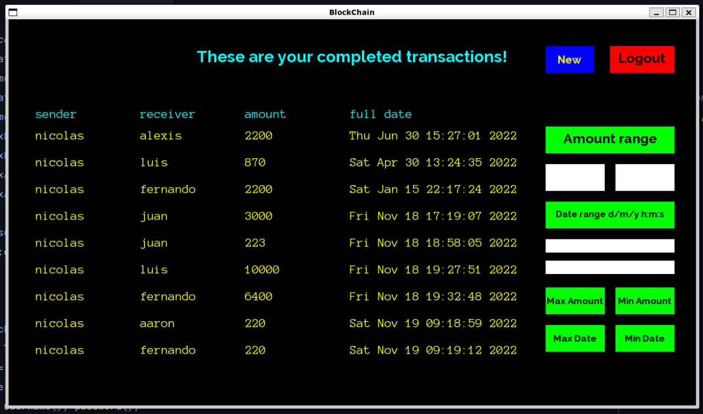
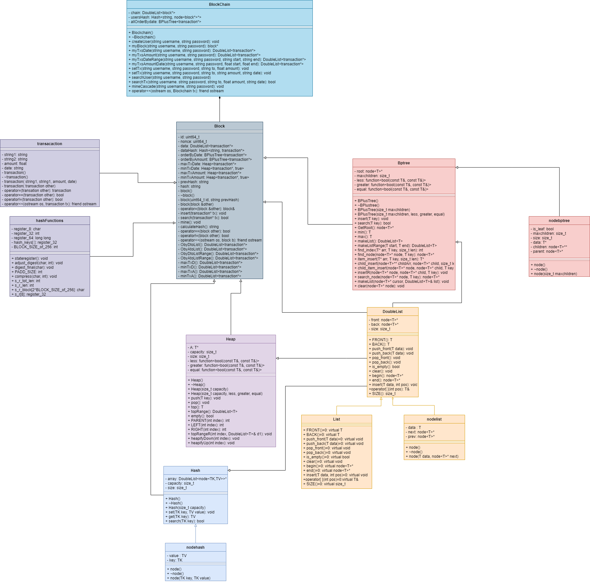

# **Blockchain**

## **Introducción**

**¿Qué es Blockchain?**

Un Blockchain es una cadena secuencial e inmutable de registros 
llamada Blocks. Pueden contener transacciones, archivos o cualquier dato que desee. Pero 
lo importante es que están encadenados mediante hashes.


**¿Qué es SHA256?**

SHA-256 (Secure Hash Algorithm 256) es un algoritmo (o función) cuyo objetivo es generar hashes 
o códigos únicos con el que se pudieran asegurar documentos o datos informáticos frente a cualquier
agente externo que desee modificarlos. una de sus características es que la longitud del hash resultante es siempre igual, sin importar lo extenso que sea el contenido que uses para generar el hash (el resultado siempre es una cadena de 64 de letras y números).


## **Objetivo**

Implementar un sistema informático transaccional que permita a un usuario del sistema registrar
operaciones de manera segura (Blockchain) para luego realizar búsquedas de manera eficiente
usando diversas estructuras de datos como mecanismos de indexación para diferentes criterios de búsqueda.

## **Propuesta**

**Dominio transaccional utilizado** : transferencias bancarias (emisor, receptor, monto, fecha)

**3 clases principales** :


* **transaction** :

Esta clase acepta los siguientes tipos de datos: string, date y float. Ello se debe a la información que contiene esta clase (sender, receiver, amount y date) y que se puede ver de la siguiente forma en la interfaz gráfica la interfaz gráfica de la siguiente forma:



* **block** :

Esta clase contiene el id, nonce, prev hash y hash. Los dos primeros son de tipo unsigned long long (tambien conocido como uint64_t).Esta clase contiene el id, nonce, prev hash y hash. Los dos primeros son de tipo unsigned long long (tambien conocido como uint64_t).

* **blockchain** :

En esta clase se registra el usuario y la contraseña (ambos serian strings) para luego poder crear un bloque de transaccion a partir de la clase block. Por lo tanto, también aceptará los mismos tipos de datos de esta última.

## **¿Qué estructuras usamos?**


* **Hash** : Usamos esta estructura para:
    - indexar a los usuarios.
    - indexar las transacciones.
    - facilitar el acceso a un nodo de un double list.

* **Heap** : Usamos esta estructura para:
    - obtener el valor máximo (*maxheap*) y mínimo (*minheap*) dentro de un grupo de valores.
    - obtener los valores máximos (*maxheap*) y mínimos (*minheap*) dentro de un grupo de valores.

* **Double List** : Usamos esta estructura para:
    - facilitar el hash en cascada en la blockchain.

* **B Plus Tree** : Usamos esta estructura para:
    - indexar las transacciones (por fecha y por monto).
    - hacer búsquedas por rango (transacciones hechas entre los montos A y B, transacciones hechas entre las fechas A y B).
    - indexar las transacciones por nombre (el nombre del usuario que hizo la transacción).
    
## ** Diagrama de clases**



- [Link directo](https://viewer.diagrams.net/?tags=%7B%7D&highlight=0000ff&edit=_blank&layers=1&nav=1&title=Diagrama%20sin%20t%C3%ADtulo.drawio#R7R1rc9q49rfcD8wknUnHL8B8DEkfe5Pd5qZpu%2Fd%2BYRQswBtjUds0sB%2F2t189jW3JRga7hIaZ7gZLR89zdHRekjr21Xz1IQKL2e%2FIg0HHMrxVx77uWJbpWFaH%2FDO8NU8ZOCZLmUa%2Bx9M2CZ%2F9vyFPNHjq0vdgnANMEAoSf5FPHKMwhOMklwaiCD3nwSYoyLe6AFMoJXweg0BO%2FeZ7yYylulZ%2Fk%2F4R%2BtOZaNnsDVjOHAhgPpJ4Bjz0nEmy33XsqwihhP2ar65gQGZPzMu339bfgtun3od%2F%2Fyf%2BDr4Mbx7%2B%2BHrBKntfp0g6hAiGyc5VP1ne5z%2Bv%2FNW3%2BfrH7Rfz%2B%2FDbzfcL1%2BFjS9ZiwqCH549%2FoiiZoSkKQfBukzqM0DL0IKnWwF8bmFuEFjjRxIl%2FwSRZc2IAywThpFkyD3guHka0%2FpN8vDUMRyT8l1T41uynENcr3gT7Wme%2F7mDkz2ECozTRuyTUgj8fAzR%2BYknv%2FSDgAJpzyOc6RstoDCsmjtNEAqIpTCrgHJsBklnNECRH0QeI8CCiNQaIYAAS%2F0eeagEn%2FmkKt0Ew%2FsFxXAPfvNs%2FQLDkLQ0XSQShRAXxsz8PQEjQPUFhIgiC4AYE%2FjTEv8d4Jsn8D3%2FAKPHxirvkGQkhg%2BF45gfeLVijJZmfOAHjJ%2FE1nKHI%2FxtXCwRF4Owo4fRi9XIQn0lJjsQIxhjmTiDRLCT9DlY5wFsQJzxhjIIALGL%2FMR3GHKPOD4coSdCcA00wuVyhAEV0DuyJO4bjMe1dhJ5gJufR7Trd%2BlRFJgquKslA5FoDjirOd%2Fv883nDw2zBmGYZ%2FuUIvts46ZgS6VwQsqXs7xL%2FCvHe0bF6AcHvA%2F4xJT%2Fe4B94vkwyVxeUqa4oXeD5YqUImkZJASqAccyyJ8twnPgoFBU%2F4q3jDG8VGK%2BWQVoB8wVFwxXbQgrp56IfhQamEQSUdi87V1bnsq1m4PclofDGGymsVUxTSSWVltG1WMkBnCSl6zhegLEfTm8pzLWzSbnnVEeSEC47CSj7nfmeR7CLt4kEJIAtONKLBfLDhFJld4j%2FYTq9Mt52O91rMuLu0Nx8438EPEquyCxEwKeLC%2BLV%2FAzjRLnsKrnd9mXHVxlBn84qE9tm44vMkhaZhO3Ap1yZYVuINObuWJ5jfNFtnaP1gW7iF6aEeltGva1AcwAeYXCHYp%2FSun0dMdgC%2BrdhuA7LbQb3pqnJYt2WcG8rcI9HawzvgmX8gDfps%2FMMf2F5%2F9DMRJ25KSi4bJb%2F1oVnfImyZvpL8FD6QTmdXKMfxnj%2BzzATM57g%2Bpzx9B8IT0MRMoYgGs8KkIRDSpAfYHKPN52zc81th5Wa%2B6Eo8SBnglVV5hO89WPeIOXk12iJ6Z0kSi2XFr8H4RTS8VFZh00b%2BcRi6m41T%2FzQG%2BH%2F4Ors4Q3Tlja14klkHykqA4JyOkay2JSVkbk8K5tQPtOZBuphwE%2FgfCQIolZ%2FH%2BTKKFGK2tQdeCPALkU7pSOjYHLzLIXOlkHnuXLApZ3MjFtjbnU6mZ1%2FSjY1sEA7ct9GTypXdru0la7R8j4voxhxOqheZEIKMwIMUDWwcYBHVj2kXPGT1Nbazu3q7dzWwGpp7%2B4dyI6SGj08H8xR6D3M%2FLBTNH0UCWkCe2q11usPHo0WjCWOprFESLvNGUtoUTxHYJ0B4CS9qfkOMSYvqA0vwJzy7ToF01qxgGNWFsA%2FWB82BJYOZneacyR5kbCcgLK1kzWnfbKvYc0hDD1HHwpzjjlQcCzTacuc01WaczzM%2B%2FEfWRYmmSHdsbRtPYsI%2FqgG19wRU%2FyUYfRX3xEdbYIrt2Moyavblh2j16AdQxPLR2LHqGA2zeDe1WQtbZkx%2BiVmDKoAKCwYJek0%2BSFlSZUKCWFM5yd20h5JyfK1mp20JV73ewcWr9U%2BxQIBeQC6E6WE0Ru78HHSvGDt6grW%2FaYF673Q6Sol1xmIZyfJ9WfQlb7k2jfyio2pckSqJVezrQ1moJRc2Wcqun4tCKPEvshybrQ3inR2y%2FDxq28Urja51JQ77bbkTlMOcNhZ8NRF85EInhW8ohnk9w4seJpyhMIekudNJ%2BOUoF%2B0Xn0x88Q9ahOQrpjZmk1kcBgxU0TDdXKRcIbpdI4gEs60NYVQ80XJoKbsbicL%2F%2FEUDvcSw%2BGEQT0VNLq6Yqhbsd3w9u7hOAHhNICbBh0j356jas9USTYF3gQCTBQhSOCQsIlYItsG%2FACm7AggEq8fjwIIJspICv1QvJgSYWk2Nc7ITnqSla98u8%2F8IkM5DRiNX70bNWVwjUvvptGa%2BC57JXYW3195%2FFt99Jv2oQV4lddgVwG%2BJOTtxD3aI59Di%2B9CAX1hVuKm5e2Bprzd%2BMmT3YIpirERXWtLMEXPNvYrYNs%2FIfrCNU%2FE1uo5p92ozegXiKe7hXiKBSxu8W6VeEzZhp0NSjwpny8qese2CxxMmK%2BzO11PsdOlvvjmz4nIdm6iP00itE19yulbjxSd2uAVyqC2ZPXqve%2Fp2t9LL1ORW2vRPJbKsr6rWva6w3nqY18Vz6PCfltamcC1pJW9v%2F%2F0x0P5uZnh5dVNee5iGc9GlF2lQT5VsfYUnHArPWi04HVvg6JVVgH58QjOF8n6rOpIEjsJUFXNI5xuDiBpHmrAgl3NEpnjVpuoKSbuLFBc2j%2B0gBFIMEV3SSV4EZwVy2RPpxba%2FPzb%2F96Jbopd4bQVtMYMFDq2ihmYrZ10cO3D6D3cR2a8dex%2BJ%2BMnI1dIWJ0j8JOJGKxjUaV6vbxiZJpb9PBiAadXDe923Sr4djQvSw5P%2FXiKO1PrXAeNOysQn6EwTluGivO1p3PJYYtEKQKMSMn%2BJx8szG3cN3gHoYFp4qihUskaA7J9Jes6Tjl2CFT%2Bv%2B5O%2FOpjVVK2sI9SpqTH9pQy2Ya0s1L2ykPd6mNfoZQpsd%2FaXRGqOEcijpPNTOUqK0mnyamrTLAeGS6GSTEk7qtovkrvmWbKnStCc%2FOXP%2BQBmap14mCt0bCsSyhpuD1VQmZYP1eV6DvOUaoStrhI8UhUiYFZ0AwG1ZpBesekGr4dzcCWjZwfIVicNAOFZgBNrwv7Kj486PVt0GtTMyj463qWYit2FWzMbi3uwJYtpERKvywLjNtBwD%2Fdj7dTI9riQ0q2ZYT%2Bq4sPtv5CrFCAVOtu0JYCZKsuTNtRAdLF85EoQBVcuCHsm7pstzUNSI565ioN3rSVGpA6nSZraEBquF0uxSO%2BLJ0r8RZoUelTSjb5sn8NZ7Ib587LTFPlF8ttd3jdXd6%2F%2B%2BPhTL4aTXW13O2797qg9799%2BKgLK0Z4n4WvdcGXZ1ZN7wwj3J%2Bsr9FzqOhRVZEvi9ICp%2B2oPYakUGdVDMkS20Tz8aeHdo1ZfbuTO0I2GAxa0We1g7Ou%2B4NhGzeKiYisA1wptt%2BuJR9wOIX8vcCQP7MQUqy6sMtSXjFYPADWHOmoLtbZUdx95UFY6SrcS9n5qXdDy77HQhAWmV8qZ%2FhRQrTqqpAsHVh1gFaxJFXc9SO2ahTPhnDVKyZiuvRLZYO8lKWqo770G0rDwJRF6sWF1amCe4PrhotpDqw6foxWkqe0LaFkMnmeAstqis%2B1GZwipF3J4MxBryUW15fDFV7GFbpm8%2BKrOM2%2B3YHjvijx1ZHdzkOqIJzkV5nb4H3I9WwVf8Krzel6Lcqv%2FcJ1CRfiQuPs8u4rlrfwtLVAOrKTZGfxNZ3ZX0N8rSCH6lW4l%2FiqQn9b4qsjm%2BoveBmy0S%2FxHPUcyc0VonAMKyE210%2FIJj889WEMqEfpTYn%2FiRSn0Z%2B0ChYHygpjHGFaYBKRRkUo8mA0XF%2BDhPc3fUqlRm94JZdzvKclu1czB6uH1aYnzIetX9oP9UqzmSFX7vF6ijJm2pfsgHbpjV55qT%2FyZdQbVAv05kBm1dnUEpZzIJDUf9TJLHVDtYTU2fsivOq0Q%2BqSzOxGBDAuLKNkBqMibCp429elJZgRn2XKgvfFRg3IT6eRlFi6qXuaxWuVlVBdNoM5e4kzg7nEg%2FESCzCQh6mVYyEz5Oyoc4OVmxel%2FrVDGUFu4u8ZIu8tgTkB4V4fUeMjr20S%2BVh8pAAcNFfzp8c1FnI2bwrtyL1wNZfNVMN7s8VhVKtL%2B9fF%2BNh%2BVVBmtn8vLvfvRe0qNFXdVHbYUUQ6elW3vjCkUnWVsnC3NVX3sPcMGvKru7ZzFK%2FuOrovybywZ3dFvzPyL1%2F1gIc8nfRnOXTbGENoqZhet9c1%2B7BF%2FdksvL6rehpSdftfCtg8BTX4okY6sb%2BG%2BlxBDdWLca9nYVXob019ll1%2FF6mAbFZIyyzRqoAAGeUKb%2B5AoWHDiuIZ2UVWjaoys3mZoWR0JP7BO0h%2Fk85sqSjzuRHxy7UmBp6HpqPN1VOlgSgb1NJDdiqpoY3k6021Mlkp0RQx0%2FW1Ixs5fhGzNsNQiJhKhmH22xIxHdlhTC31VzM8DSdxQ2WuNz1vYqgWgGn07UGb4kbXzV8wdeFYsr2%2BqzzUYLQmcKif2RhT%2BinRZKkOUKYGL2MYxdutrVkPdr6%2BsopBEHxiplOvrv1VkwOmBFBGMr88B2ziJRAlAbd2PLoruyp3Fph18XwkAnMFP2sI%2B4rj0UrstyUwd8ueAqF7IOVhqiMClbljGtr%2FBXOxs9SIT3haCOawaNsHcfyMIq8qVny%2Bpq3VrStlicXaHlYxcdvUra%2B2RTPTHnPM%2FMwWyQiZZVm30UIylTwKaVgqbmwyaqGAJXOtK9s1kbR3z2KYPKx2nasE5XvDNLHqp94baC5NyGp%2BaSJTAbe9Nl9zlaorUQ3l7c7zVj4OZXAhcZhdgXgMvNpLWjkvNfTHDRfsNKE%2BnoSn%2BtunfJRFuX1aptXSBipaO5CH4oK4KHqdnIuiZ6b3vr1kF4V4A%2FXYXBSi3xmRiQREvOeHsuOTzeBluSjS6NyKF5HStBzTaO%2F5NHWUVwSnWG6B0chlOwneWqKCCp%2BC2JbqwGcOpOcwkADRzY%2F9kQJ5Rk9wHacB6axEtpV8ieHtp6ubEYk%2FH6HJyOr2Nr2od5Haq7eVpmxkr9hEFd26rVkKVCfJT661XVxr9bGfPqK2Ff1tYV%2F15NSQ6WOYV3CWUXkQH3h%2FLeNk5PlTPI1njL3xozRVxRj8aOJjEYmWqgK%2Bu7y%2Bpgyq%2FED8GM0XeFeL9XsQj6JRgpJRIF5pU1VLgLYCMNGqO7TeyKxUsN8C308L42KumkefmG57y05xWl617EyBh%2BZPy7uHUTF%2B8q3PuuqAmOdDP6BjFe%2FXGthZVNcu0M5lbf0DEU8aQTcYdPPqqdE%2FiqsDtelR3Cd5aHo03Dx59d1tDzq5xdgtZy%2BCxJ8RQkkWPAKL2e%2FIgwTi%2Fw%3D%3D)

# Analisis de la complejidad algoritmica
```c++
Blockchain::createUser       // O(k), k:=cantidad promedio de valores en cada bucket del hash
Inserta un nuevo usuario en la blockchain, ademas, guarda en un hash
un puntero al bloque de ese usuario.

Blockchain::setTx            // O(log2(n)), n := cantidad de elementos en el heap
Inserta una nueva transaccion en la blockchain. Ademas, realiza inserciones
en cada uno de los indices utilizados (Hash, Heap, B+Tree)
```

## **¿Cómo correr el proyecto?**

**Requerimentos** :
- [SFML 2.5.1](https://www.sfml-dev.org/download/sfml/2.5.1/)
- [MinGW](https://www.mingw-w64.org/downloads/)

**Ejecutar en terminal** :

```
g++ -IC:\SFML-2.5.1\include\ -c main.cpp -o main.o
g++ -LC:\SFML-2.5.1\lib .\main.o -o main.exe -lmingw32 -lsfml-graphics -lsfml-window -lsfml-system
```
## **Referencias Bibliograficas**

- [Convert to SHA256 in C++ | Delft Stack](https://www.delftstack.com/howto/cpp/sha256-cpp/)
- [Blockchain Demo](https://andersbrownworth.com/blockchain/)
- [B+ Tree Visualization](https://www.cs.usfca.edu/~galles/visualization/BPlusTree.html)
- [B+Tree Basics](https://www.youtube.com/watch?v=49P_GDeMDRo)
- [B+Tree Insertions](https://youtu.be/h6Mw7_S4ai0)
