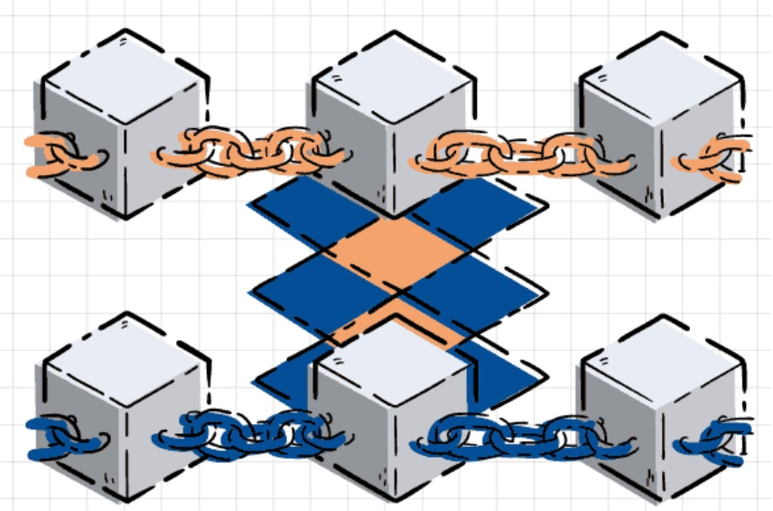
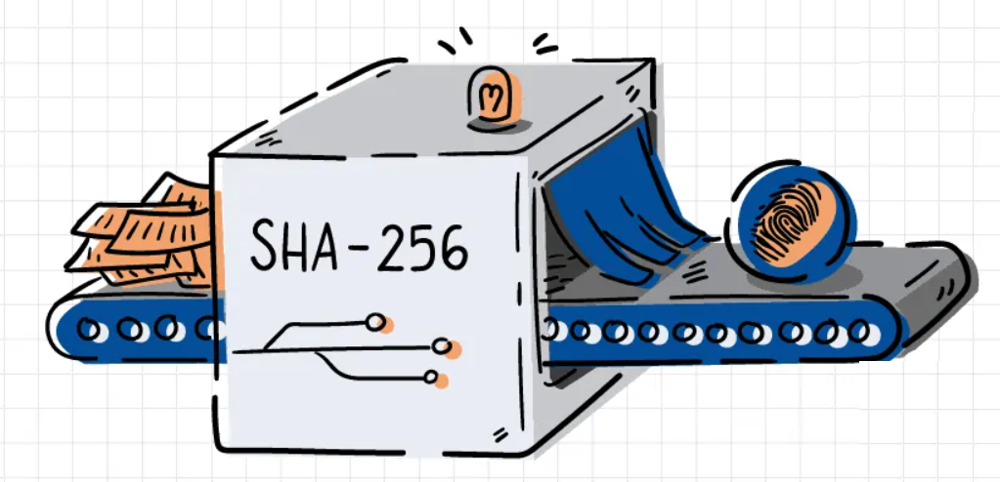
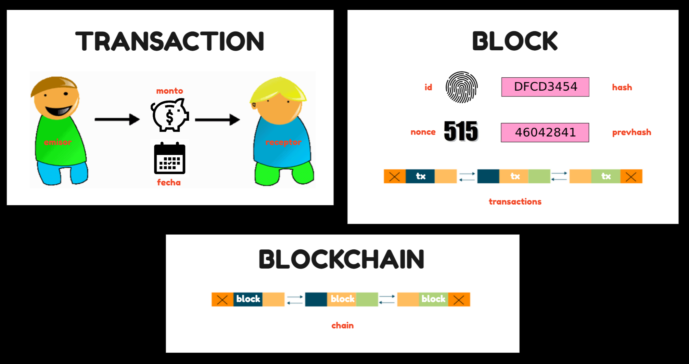
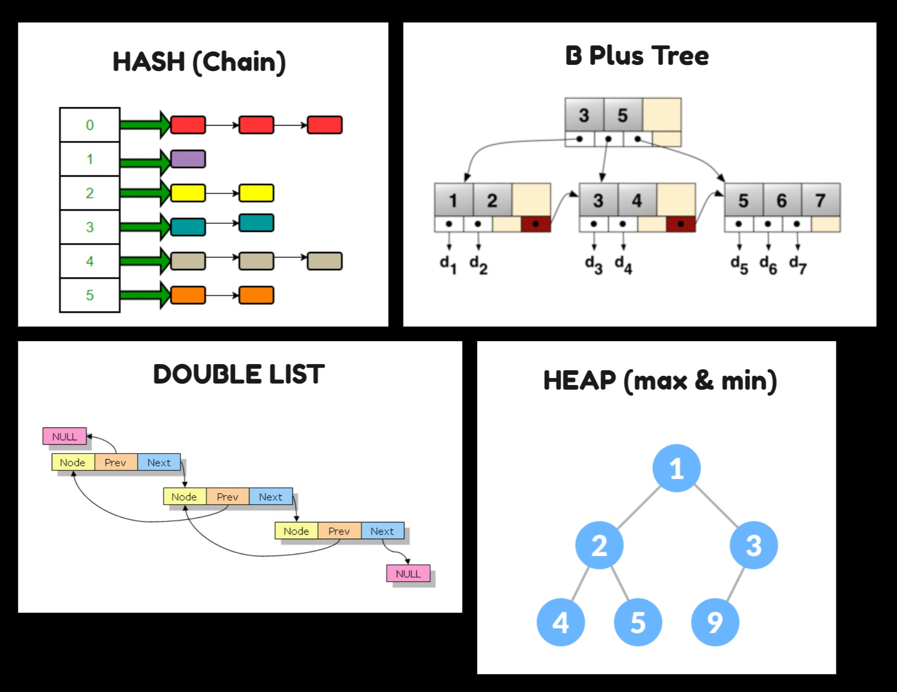

# **Blockchain**

## **Introducción**

**¿Qué es Blockchain?**

Un Blockchain es una cadena secuencial e inmutable de registros 
llamada Blocks. Pueden contener transacciones, archivos o cualquier dato que desee. Pero 
lo importante es que están encadenados mediante hashes.



**¿Qué es SHA256?**

SHA-256 (Secure Hash Algorithm 256) es un algoritmo (o función) cuyo objetivo es generar hashes 
o códigos únicos con el que se pudieran asegurar documentos o datos informáticos frente a cualquier
agente externo que desee modificarlos. una de sus características es que la longitud del hash resultante es siempre igual, sin importar lo extenso que sea el contenido que uses para generar el hash (el resultado siempre es una cadena de 64 de letras y números).



## **Objetivo**

Implementar un sistema informático transaccional que permita a un usuario del sistema registrar
operaciones de manera segura (Blockchain) para luego realizar búsquedas de manera eficiente
usando diversas estructuras de datos como mecanismos de indexación para diferentes criterios de búsqueda.

## **Propuesta**

**Dominio transaccional utilizado** : transferencias bancarias (emisor, receptor, monto, fecha)

**3 clases principales** :



* **transaction** :

* **block** :

* **blockchain** :

## **¿Qué estructuras usamos?**



* **Hash** : Usamos esta estructura para:
    - indexar a los usuarios.
    - indexar las transacciones.
    - facilitar el acceso a un nodo de un double list.

* **Heap** : Usamos esta estructura para:
    - obtener el valor máximo (*maxheap*) y mínimo (*minheap*) dentro de un grupo de valores.
    - obtener los valores máximos (*maxheap*) y mínimos (*minheap*) dentro de un grupo de valores.

* **Double List** : Usamos esta estructura para:
    - facilitar el hash en cascada en la blockchain.

* **B Plus Tree** : Usamos esta estructura para:
    - indexar las transacciones (por fecha y por monto).
    - hacer búsquedas por rango (transacciones hechas entre los montos A y B, transacciones hechas entre las fechas A y B).
    - indexar las transacciones por nombre (el nombre del usuario que hizo la transacción).

## **¿Cómo correr el proyecto?**

**Requerimentos** :
- [SFML 2.5.1](https://www.sfml-dev.org/download/sfml/2.5.1/)
- [MinGW](https://www.mingw-w64.org/downloads/)

**Ejecutar en terminal** :

```
g++ -IC:\SFML-2.5.1\include\ -c main.cpp -o main.o
g++ -LC:\SFML-2.5.1\lib .\main.o -o main.exe -lmingw32 -lsfml-graphics -lsfml-window -lsfml-system
```
## **Referencias Bibliograficas**

- [Convert to SHA256 in C++ | Delft Stack](https://www.delftstack.com/howto/cpp/sha256-cpp/)
- [Blockchain Demo](https://andersbrownworth.com/blockchain/)
- [B+ Tree Visualization](https://www.cs.usfca.edu/~galles/visualization/BPlusTree.html)
- [B+Tree Basics](https://www.youtube.com/watch?v=49P_GDeMDRo)
- [B+Tree Insertions](https://youtu.be/h6Mw7_S4ai0)
